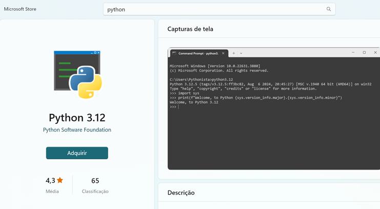
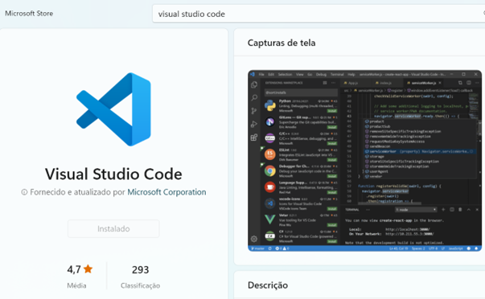
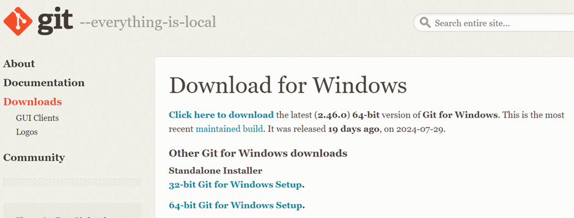
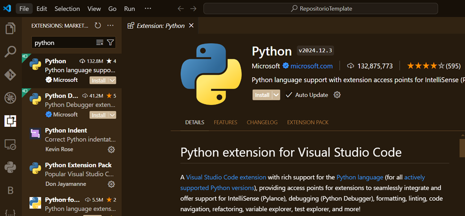
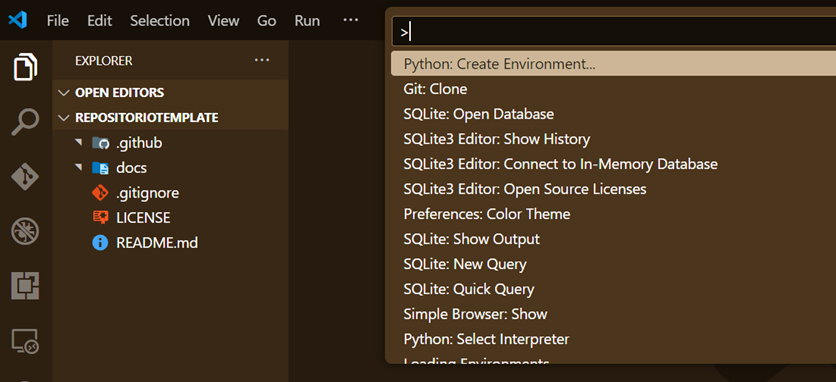

# **Ambiente de Desenvolvimento**

# **Instalação softwares**

## **Python**

No Microsoft Store, instale o **Python mais atualizado** ou faça o download do site [python.org](https://www.python.org/downloads).



## Visual Studio Code

No Microsoft Store, instale ou baixe o **Visual Studio Code** mais atualizado.



## Baixar e instalar o Git

Faça o download da versão mais recente do Git para Windows:

[Git-2.46.0-64-bit.exe](https://github.com/git-for-windows/git/releases/download/v2.46.0.windows.1/Git-2.46.0-64-bit.exe)



### Caso precise adicionar o Git ao Path do Windows

No Prompt de Comando, digite:
```bash
rundll32 sysdm.cpl,EditEnvironmentVariables
```
Adicione o caminho de instalação do Git na variável `PATH`.

**Exemplo:**
```bash
C:\Program Files\Git\cmd
```

---

## Configuração do Git

Adicione suas credenciais no Git:
```bash
git config --global user.name "Your Name"
git config --global user.email "youremail@yourdomain.com"
```

---

## Configurar o Visual Studio Code

### Instalar a extensão do Python

Abra o Visual Studio Code e instale a extensão oficial do Python.



---

## Ambiente Virtual

Agora vamos instalar o ambiente virtual, que permite isolar pastas (projetos) com versões específicas.

1. Aperte `Ctrl + Shift + P` e selecione **Python: Create Environment...**.
2. Após a instalação, aparecerá a pasta `.venv`.



[Pasta Venv](../assets/ambiente/pastavenv.png)


## Site de Documentação

Abra um Terminal para prosseguirmos com a instalação do **MkDocs**, uma ferramenta que cria sites de documentação a partir de arquivos `.md` (Markdown).

[Terminal](../assets/ambiente/terminal.png)

### Instalação do MkDocs
```bash
pip install mkdocs
```

Confirme que a instalação ocorreu com sucesso. Na pasta `[.venv\Lib\site-packages]`, você deve observar o pacote `mkdocs` entre outros dependentes.


### Criação do Projeto MkDocs
Execute o comando abaixo para criar os arquivos de configuração:
```bash
mkdocs new
```

Esse comando cria dois arquivos principais:
- `mkdocs.yml`
- `index.md`


### Executar o Servidor MkDocs
Para visualizar o site renderizado, execute:
```bash
mkdocs serve
```

Abra o navegador e clique no link disponibilizado:
```
http://127.0.0.1:8000/
```


---

## Requirements.txt

A criação desse arquivo é importante para facilitar o controle de bibliotecas instaladas no ambiente virtual `.venv`. Execute o comando:
```bash
pip freeze > requirements.txt
```

Isso evita que, em cada local de desenvolvimento, seja necessário instalar uma por uma das bibliotecas.

---

## Repositório no GitHub

Para publicar o repositório no GitHub, clique em **Publish to GitHub** na aba esquerda do VSCode.

Desmarque a pasta `.venv` para que ela não seja enviada ao repositório e clique em **OK**.


Após a conclusão, será exibida uma mensagem de sucesso com o link para o repositório.

---

## Instalação Remota (Casa, Trabalho, etc.)

Com esses passos realizados, já é possível replicar esse ambiente em outro local.

1. Verifique se o **Python**, **VSCode** e **Git** estão instalados, de preferência na mesma versão.
2. Clone o repositório:
   ```bash
   git clone https://github.com/jonh-carvalho/TutorialAmbiente.git
   ```
3. Aperte `Ctrl + Shift + P` e selecione **Python: Create Environment**, utilizando o arquivo `requirements.txt` para instalar todas as bibliotecas necessárias.


---

> **Nota**: Substitua os links das imagens pelos caminhos corretos na pasta `images/`.