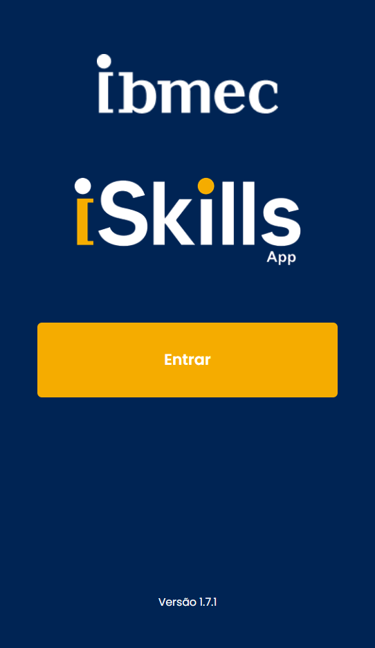

---
hide:
    - navigation
    - toc
    - template: home.html
---

-    :material-react:{ .lg .right } __Projeto Front-End__
    
    ---
    
    Disciplina que apresenta os passos para a construção de Projeto Front-End.

    **Linguagens**: HTML, CSS e Javascript
    **Tecnologias**:
    
    - Tecnologias
    - Visual Studio Code - Markdown 
    - Github - MkDocs 
    - Git - GitHub Pages

-   __ISkills__
    
    ---

    
    

-   :material-github:{ .lg .right } __PECD1_26.1_8001_I__

    ---

    XXXXX XXX, XXXX XXXX, XXXX XXXX

    [:octicons-arrow-right-24: Repositório](https://github.com/Projetos-de-Extensao/PECD1_26.1_8001_I)

-   :material-github:{ .lg .right } __PECD1_26.1_8001_II__

    ---

    XXXXX XXX, XXXX XXXX, XXXX XXXX

    [:octicons-arrow-right-24: Repositório](https://github.com/Projetos-de-Extensao/PECD1_26.1_8001_II)

